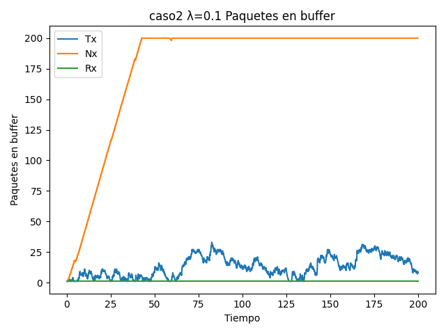
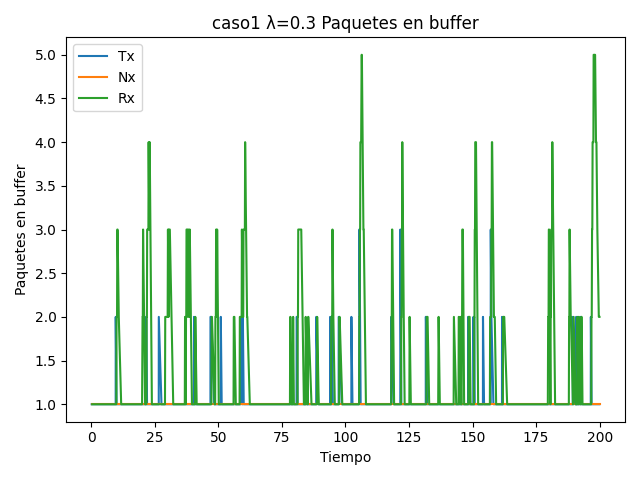
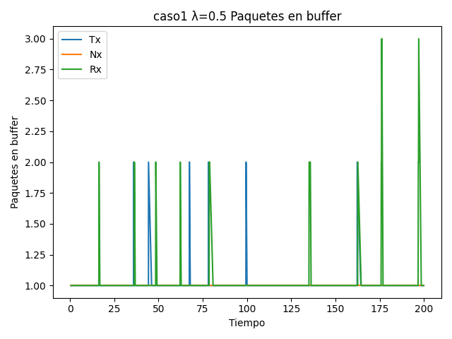
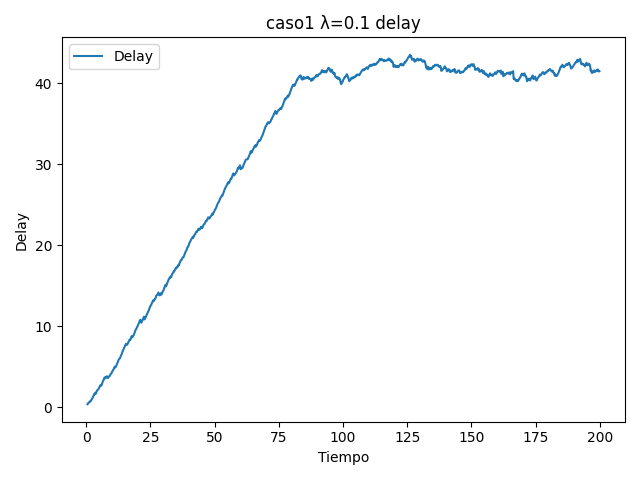
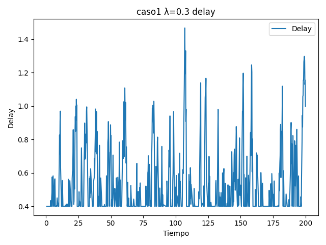

# Estudio sobre control de flujo y congestión mediante simulaciones en Omnet++

### Autores: 
- Bonfils, Gastón
- Lozano, Benjamin
- Ayala, Facundo

## Introducción

Este proyecto tuvo como objetivo simular un modelo productor-consumidor a través de una red simple usando la herramienta Omnet++. Dicha red solo contaba con un único buffer intermedio que se podía llenar y perder paquetes.  
El proyecto se estructuró en dos partes. La primera consistió en realizar mediciones sin la implementación de algoritmos de control de flujo y congestión. Posteriormenete, en la segunda parte se implementó un algoritmo simple de control de flujo y congestión.

## Experimentos
Se nos pidió correr simulaciones para cada caso haciendo variar el intervalo de generación de paquetes entre 0.1 y 1 en los cuales se tomaron las mediciones:  
  - Tamaño de cada buffer en cada momento    
  - Delay de entrega de los paquetes   
  - Paquetes generados, recibidos y perdidos  

### Aclaraciones sobre resultados similares o irrelevantes
A la hora de correr los diferentes experimentos nos dimos cuenta que algunos casos de prueba no eran necesarios de hacer o que había casos con datos iguales. Con esto en cuenta, reducimos la cantidad de información redudante o irrelevante a mostrar. Justificamos con las siguientes aclaraciones.  

#### Diferencias entre caso 1 y caso 2
La principal diferencia entre el caso 1 y 2 es entre el buffer del medio y el buffer del consumidor, lo cual define quien actúa como cuello de botella en la red. En el caso 1, lo limitante es la velocidad de consumo del receptor, mientras en el caso 2 es la velocidad de transmisión entre la cola del medio y el consumidor.  
Debido a este intercambio, en los gráficos vamos a ver resultados similares entre los casos pero con cambios en el buffer del nodo intermedio y el buffer del receptor. En el siguiente ejemplo se muestra esté fenomeno:

| Caso 1  | Caso 2 |
|-------- | ---------- |
| ||
*Ejemplo de similitud de Caso 1 y Caso 2 para media igual a 0.1.* 

Ademas de la similitud en el tamaño de buffers, también son iguales para el delay de llegada de los paquetes, pues la tasa de transferencia total sigue siendo la misma. De misma manera, los paquetes envíados y recibidos son los mismos en cada caso.

Por estas razones, **se van a mostrar solo gráficos del caso 1** para comparar las medias de generación.

#### Diferencias en el cambio de media de generación de paquetes
Para le media se nos pidio que corramos para casos de $\lambda$ = 0.1 a 1.0. Lo que observamos es que apartir de $\lambda$ = 0.3 en adelante los gráficos empezaban a ser iguales y no representaban información importante, pues los buffers nunca llegan a saturarse. 

| Caso 1 $\lambda=0.3$   | Caso 1 $\lambda=0.4$  | Caso 1 $\lambda=0.5$ |
|--------------- | --------------- | ---- |
| | |  |

Por lo que **solo vamos a mostrar gráficos para $\lambda$ = 0.1, 0.2 y 0.3** . 

### Gráficos!
Con lo previamente aclarado, los gráficos se van a presentar solo para el caso 1 con $\lambda$ = 0.1, 0.2 y 0.3. Ya que el caso 2 es lo mismo pero cambiando el color verde por naranja

| $\lambda = 0.1$    | $\lambda = 0.2$ | $\lambda = 0.3$|
|---------------- | --------------- | --------------- |
|  |  | |
| |  | |
|  |  |  | 

Podemos observar como en un intervalo chico de generación ($\lambda$ = 0.1) la red se satura y hay perdida de paquetes. Al aumentar el intervalo, disminuye la saturación de la red y empeizan a haber menos perdida de paquetes y llegan con menor delay. El problema de esto se puede observar en el siguiente gráfico:

Nosotros queremos mejorar estos resultados para poder aprovechar mejor la red. Para ello ideamos un algoritmo de control de flujo y congestión.

## Métodos
Primero tuvimos que añadir un nodo extra como canal de comuniación entre `nodeTx` y `nodeRx` para que `nodeRx` pueda enviar mensajes de feedback para poder controlar mejor la saturación de buffers.  

Nosotros implementamos un algoritmo en cual si el buffer de `nodeRx` superaba un umbral del **80% de su tamaño**, este va a mandar un mensaje de feedback para que `nodeTx` reduzca su taza de transmisión un 10%. Luego de cierto tiempo, la velocidad de transmisión volvería a lo normal.  

## Resultados

### Gráficos y analisis

| $\lambda = 0.1$    | $\lambda = 0.2$ | $\lambda = 0.3$|
|---------------- | --------------- | --------------- |
|  |  | |
| |  | |
|  |  |  | 

Lo primero que podemos observar es lo similir que son los gráficos para los casos de $\lambda$ = 0.2 y 0.3 por lo que los vamos a ignorar. 
Lo destacable a observar en los gráficos aumento de paquetes en el nodo transmisor para el caso $\lambda$ = 0.1 y como esto afecta el delay de la llegada de los paquetes. Esto se debe a que en intervalos de generación muy bajos se llega al umbral muy rápidamente. De todas formas no hay diferencia entre la llegada y pérdida de paquetes.  

Lo interesante de este algoritmo es que nos da gráficos mas distintos para el caso 2.  
| $\lambda = 0.1$    | $\lambda = 0.2$ | $\lambda = 0.3$|
|---------------- | --------------- | --------------- |
|  |  | |
| |  | |
|  |  |  | 

En este caso, los paquetes pasan mas tiempo en la cola intermedia y tardan menos en llegar. De todas formas la pérdida de paquetes se mantiene igual.  

Como el envío y recibida de paquetes se mantiene igual, la carga útil también 

### Conclusión
Haciendo el análisis de nuestros resultados podemos concluir que nuestro algoritmo de control de flujo y congestión que implementamos no provocó un cambio necesario para ver una mejora en el aprovechamiento de red. 

## Discusión
No habremos obtenido mejoras con nuestros cambios pero, por lo menos se pudo ver un caso donde nuestro algoritmo no funciona. En nuestros casos de estudio dejamos muchas variables fijas por lo que puede llegar a existir un caso específico en donde nuestra solución nos devuelva mejores resultados. 

## Referencias

  - [OMNeT++ Documentation](https://omnetpp.org/documentation/)
  - Andrew S. Tanenbaum (2013) Redes de computadoras. 5ta edición
  - Juan Fraire (2021) [Redes y Sistemas Distribuidos - Introducción a OMNeT++](https://www.youtube.com/watch?v=6J_0ZKquNWU&t) 

