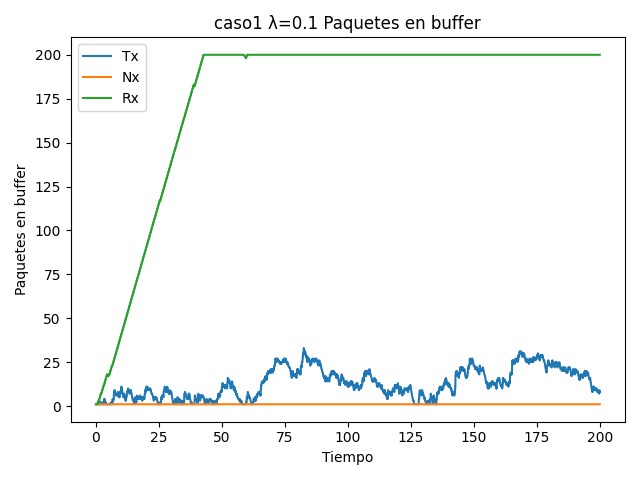
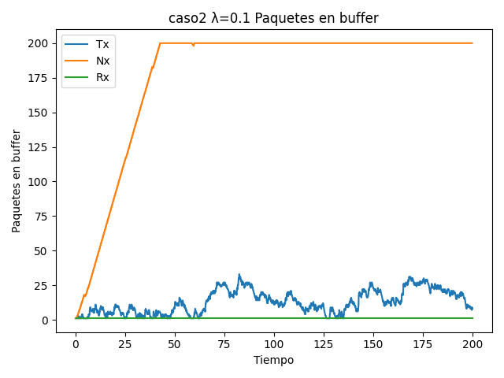
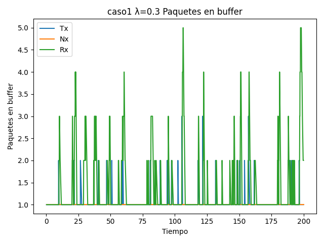
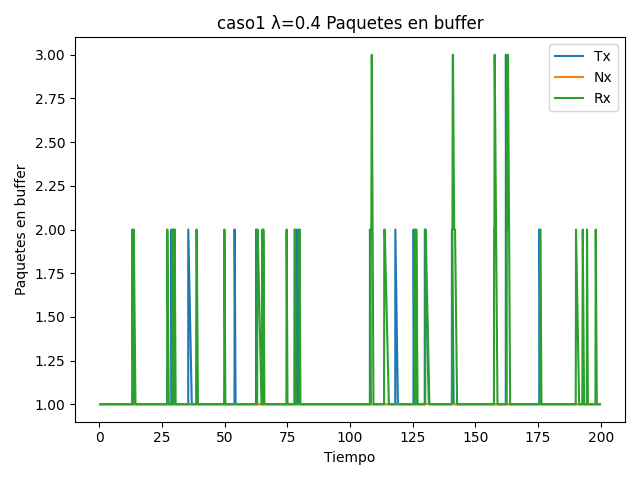
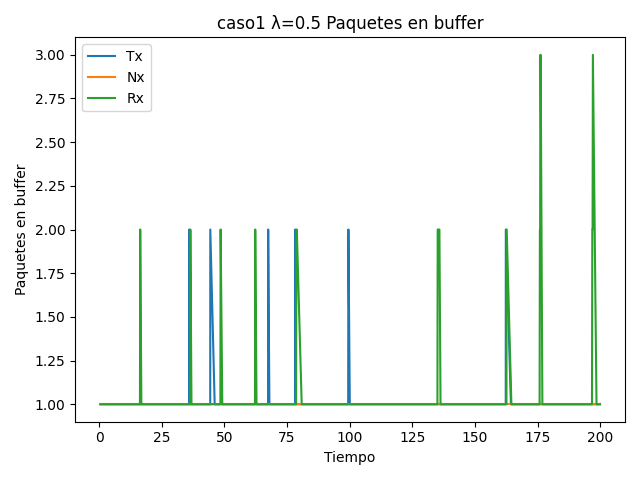
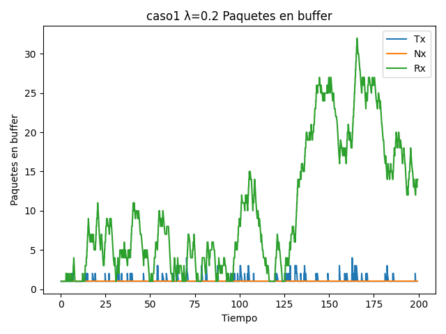
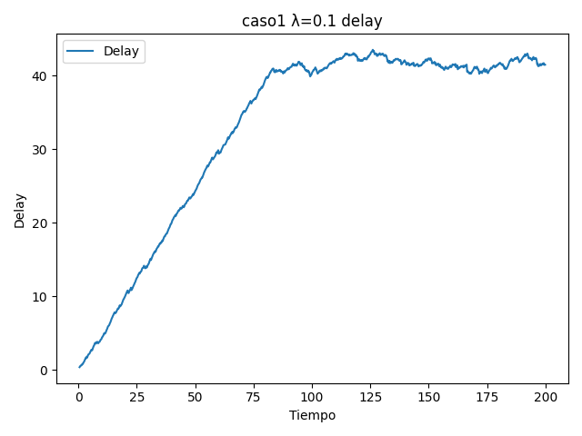
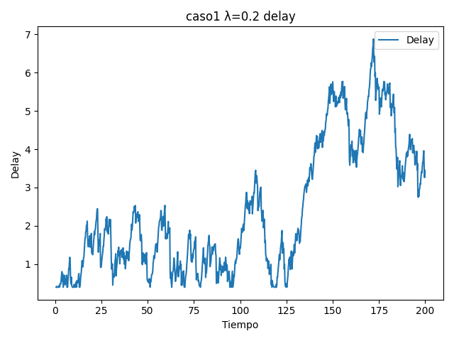
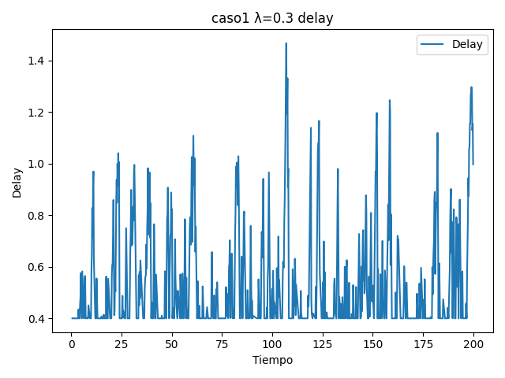

# Informe Lab 3 Redes

## Introducción
> introducimos el experimento dando el modelo de la red
> los 2 casos de estudio
> las dos partes del experimento

## Experimentos
Se nos pidió correr simulaciones para cada caso haciendo variar el intervalo de generación de paquetes entre 0.1 y 1 en los cuales se tomaron las mediciones:  
- Tamaño de cada buffer en cada momento  
- Delay de entrega de los paquetes 
- Paquetes generados, recibidos y perdidos

### Aclaraciones sobre resultados similares o irrelevantes
A la hora de correr los diferentes experimentos nos dimos cuenta que algunos casos de prueba no eran necesarios de hacer o que había casos con datos iguales. Con esto en cuenta, reducimos la cantidad de información redudante o irrelevante a mostrar. Justificamos con las siguientes aclaraciones. 

#### Diferencias entre caso 1 y caso 2
La principal diferencia entre el caso 1 y 2 es entre el buffer del medio y el buffer del consumidor, lo cual define quien actúa como cuello de botella en la red. En el caso 1, lo limitante es la velocidad de consumo del receptor, mientras en el caso 2 es la velocidad de transmisión entre la cola del medio y el consumidor. 
Debido a este intercambio, en los gráficos vamos a ver resultados similares entre los casos pero con cambios en el buffer del nodo intermedio y el buffer del receptor. En el siguiente ejemplo se muestra esté fenomeno:

| Caso 1  | Caso 2 |
|-------- | ---------- |
| ||
*Ejemplo de similitud de Caso 1 y Caso 2 para media igual a 0.1.* 

Ademas de la similitud en el tamaño de buffers, también son iguales para el delay de llegada de los paquetes, pues la tasa de transferencia total sigue siendo la misma. 

> MOSTRAR SIMILITUD EN GEN, REB, Y PER DE PAQUETES 

Por estas razones, **se van a mostrar solo gráficos del caso 1** para comparar las medias de generación.

#### Diferencias en el cambio de media de generación de paquetes
Para le media se nos pidio que corramos para casos de $\lambda$ = 0.1 a 1.0. Lo que observamos es que apartir de $\lambda$ = 0.3 en adelante los gráficos empezaban a ser iguales y no representaban información importante, pues los buffers nunca llegan a saturarse. 

| Caso 1 $\lambda=0.3$   | Caso 1 $\lambda=0.4$  | Caso 1 $\lambda=0.5$ |
|--------------- | --------------- | ---- |
| | |  |

Por lo que **solo vamos a mostrar gráficos para $\lambda$ = 0.1, 0.2 y 0.3** . 

### Gráficos!

Con lo previamente aclarado, los gráficos se van a presentar solo para el caso 1 con $\lambda$ = 0.1, 0.2 y 0.3.

| $\lambda = 0.1$    | $\lambda = 0.2$ | $\lambda = 0.3$|
|---------------- | --------------- | --------------- |
|  |  | |
| |  | |
| GRAFICOS DE PAQUETES 0.1 | IDEM 0.2 | IDEM 0.3 | 

